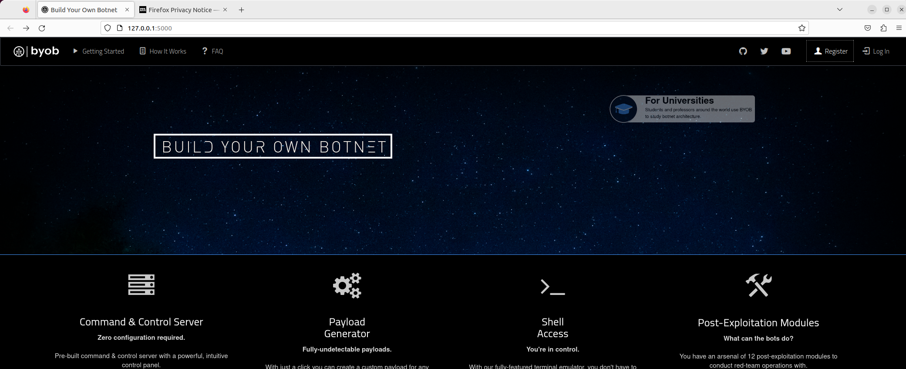

# 🛠 Getting set up

Step 0: Installation and Setup

Prepare new-clean Ubuntu VM

The first thing you need to do to start using BYOB is [download](https://github.com/PetrGallus/Botnet-BYOB) the updated repository from Github.

You will need to install [Docker](https://docs.docker.com/get-docker/) and [Python](https://www.python.org/downloads/) to use this software.

Sub-steps:

* prepare clean UBUNTU VM
* sudo apt-get install git
* git clone repository from Github
  * git clone [https://github.com/PetrGallus/Botnet-BYOB.git](https://github.com/PetrGallus/Botnet-BYOB.git)
* cd byob/web-gui
  * sudo ./startup.sh
    * it will install necessarry SW (python packages, Docker images...)
    * after finish -> Reboot \[Y]
* after reboot, run the script again
  * sudo ./startup.sh
    * you should see the running web server
      * 127.0.0.1:5000

.png>)

Step 1: Create an Account

Once the web app is up and running, you are now ready to create an account. You can do this clicking on the register button on the top right...

This will you up as the sole administrator of the command & control server and restrict others from accessing it.

.png>)

Step 2: Generate a Payload

Once you are logged in, the first thing you need to do is generate a payload. To get started, click the Payloads button at the top of the screen to navigate to the payloads page.

The payloads page has 2 main parts:

* [Payload Generator](getting-set-up.md#payload-generator)
* [Payloads Table](getting-set-up.md#payloads-table)

#### Payload Generator

_**Python**_

Select "Python" format as the format to generate an obfuscated Python script.

Python is platform independent, so you will not need to select a target operating system and architecture.

The file size is small, however, Python must be installed on the target machine to execute it.

\
_**Executable**_

Select "Executable" format to compile a binary executable for a target operating system and architecture.

You must select the operating system and architecture of the target machine(s) in order to compile an executable.

This will run on systems which do not have Python installed, however, the file size is substantially larger.

#### Payloads Table

Below the payload generator you can see the payloads table, where you can download payloads you have generated by selecting the "download" icon on the right as seen below.

You can use the sort by "created" to find the most recently generated payload. There is also a search bar at the top right of the table that you can use to view only your Windows payloads, for example.

Step 3: Create Bots

After downloading a payload, you can create bots by executing the payload on target machines.

This platform is strictly for authorized testing and education purposes, so this is done by simply downloading the payload onto your virtual machine or testing environment.

In a real world scenario an attacker would most likely use a social-engineering trick to get the target to execute the payload, such as sending it as an email attachment disguised as a software update.

Step 4: Command &#x26; Control

Once you have a payload running on a target machine, you are ready to command and control your bots!

To get started, click the Control Panel button at the top of the screen to navigate to your command and control dashboard.

The control panel dashboard is designed to provide an intuitive command & control interface. It has 3 main parts:

* [Post-Exploitation Modules](getting-set-up.md#post-exploitation-modules)
* [Bots Table](getting-set-up.md#bots-table)
* [Shell Access](getting-set-up.md#shell-access)

#### Post-Exploitation Modules

Select a post-exploitation module using the panel on the left. Each module contains a description and a list of supported platforms.

Next, select the bots to execute it on by either clicking "select all bots" or selecting bots from the Bots Table below.

Now click execute and watch the results stream in!

#### Bots Table

The bots table contains identifying information about your bots and allows you to monitor their status and interact with them directly. It is fully searchable and sortable by column for your convenience.

If your bots are mining monero, the "Hashes/Second" column and "Hashrate Graph" will update every second so you monitor their progress in real time.

You can view a bot's history of commands and results by clicking the "Results" button on the right, or kill the bot by clicking the Trash icon.

And yes, clicking the terminal icon provides direct shell access to the bot!

#### Shell Access

Click the terminal icon for any bot to connect directly to the bot via reverse TCP shell.

A fully-featured terminal emulator runs in the browser which behaves exactly the same as the terminal on the machine.

This provides you with direct access full control over the machine so you can run standard red team operations which require terminal access.

